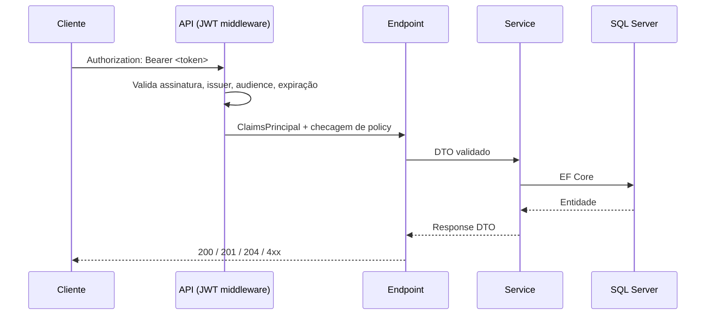
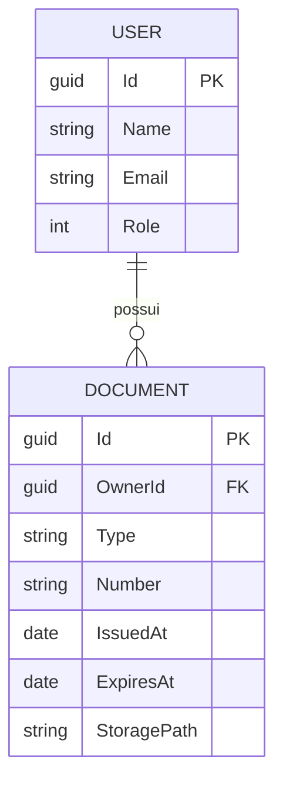

# Authdoc

API de autenticação e controle de acesso para uma plataforma de **organização de documentos de imigrantes**.

Construída em **ASP.NET Core 10 (Minimal APIs)**, com **JWT**, **Entity Framework Core** e **SQL Server**.

---

## Visão do produto

Imigrantes lidam com um volume grande de documentos críticos: passaporte, vistos, autorizações de residência, certidões e comprovantes. Esses documentos costumam estar espalhados e ter prazos de validade. O Authdoc tem como objetivo centralizar esses documentos com uma garantia central:

> **Cada usuário acessa exclusivamente os próprios documentos.**

Por isso o projeto começa pela camada de identidade. Autenticação, papéis (roles) e emissão de tokens são a base sobre a qual o módulo de documentos será construído.

## Status atual

| Módulo | Status |
|---|---|
| Autenticação (login, emissão de JWT) | ✅ Implementado |
| Autorização por papel (`Admin` / `User`) | ✅ Implementado |
| Gestão de usuários (CRUD administrativo) | ✅ Implementado |
| Bootstrap automático (migrations + admin inicial) | ✅ Implementado |
| **Módulo de documentos** | 🚧 Próxima etapa |
| Vínculo documento ↔ usuário com autorização por propriedade | 🚧 Próxima etapa |

Hoje o Authdoc é uma **API de identidade e gestão de usuários**. O módulo de documentos vem em seguida e vai reutilizar toda a infraestrutura de autenticação já existente.

---

## Stack

| Camada | Tecnologia |
|---|---|
| Runtime | .NET 10 |
| Web | ASP.NET Core Minimal APIs |
| Persistência | Entity Framework Core 10 + SQL Server |
| Autenticação | JWT Bearer (`Microsoft.AspNetCore.Authentication.JwtBearer`) |
| Hash de senha | `IPasswordHasher<T>` do ASP.NET Core Identity (PBKDF2) |
| Documentação | OpenAPI + [Scalar](https://scalar.com) |

## Conceitos e fundamentos aplicados

- **Autenticação stateless com JWT:** o token é assinado com HMAC-SHA256 e carrega claims de identidade (`NameIdentifier`, `Name`, `Email`, `Role`). A API valida issuer, audience, tempo de vida e assinatura em cada requisição.
- **Autorização baseada em papéis (RBAC):** uma policy `Admin` protege as rotas administrativas.
- **Hash de senha com salt:** as senhas nunca são persistidas em texto puro. O `PasswordHasher` gera hashes PBKDF2 com salt aleatório e versionamento de formato, o que permite fazer rehash quando o algoritmo evolui.
- **Injeção de dependência e ciclo de vida de serviços:** services e `DbContext` são registrados como *Scoped* (um por requisição). No startup, um escopo explícito é criado para o bootstrap do banco.
- **Code-first com EF Core Migrations:** o schema é versionado em código e aplicado automaticamente na inicialização.
- **Separação em camadas:** endpoints (HTTP) → services (regras de negócio) → `DbContext` (persistência), com DTOs isolando o contrato da API do modelo de domínio.
- **Identificadores GUID:** evitam enumeração sequencial de recursos, algo relevante quando os recursos forem documentos pessoais.
- **Semântica HTTP:** `201 Created` com `Location`, `204 No Content` e `409 Conflict` para e-mail duplicado.

---

## Arquitetura

```
Authdoc/
├── Program.cs                     # Composição: DI, JWT, policies, bootstrap, pipeline
└── Src/
    ├── Endpoints/                 # Mapeamento HTTP (Minimal API) e validação de entrada
    ├── Application/
    │   ├── DTOs/                  # Contratos de request/response
    │   └── Services/              # AuthService, UserService (regras de negócio)
    ├── Data/
    │   ├── ManagerDbContext.cs    # DbContext e configuração do modelo
    │   ├── DbInitializer.cs       # Migrations + seed do admin inicial
    │   └── Migrations/
    ├── Models/Entities/           # Entidades de domínio (User, UserRole)
    └── Responses/                 # Formato padrão de erro
```

Fluxo de uma requisição autenticada:



---

## Como executar

### Pré-requisitos

- [.NET SDK 10](https://dotnet.microsoft.com/download)
- SQL Server (a configuração padrão aponta para `localhost\SQLEXPRESS` com autenticação integrada do Windows)
- Opcional: `dotnet tool install --global dotnet-ef`, para gerenciar migrations

### Configuração

As configurações não sensíveis ficam em `Authdoc/appsettings.json`:

```json
{
  "ConnectionStrings": {
    "DefaultConnection": "Server=localhost\\SQLEXPRESS;Database=Authdoc;Trusted_Connection=True;TrustServerCertificate=True;"
  },
  "Jwt": {
    "Issuer": "Authdoc",
    "Audience": "Users",
    "ExpirationInMinutes": 60
  }
}
```

A connection string tem uma fonte única: o `appsettings.json`. Ela é usada tanto pela aplicação quanto pelo `dotnet ef`.

### JWT signing key

The JWT signing key is a secret, so it is **not** stored in `appsettings.json`. The API reads it from the `Jwt:Key` setting, which must hold at least 32 bytes (HS256). Generate a random key once and store it with [User Secrets](https://learn.microsoft.com/aspnet/core/security/app-secrets), which keeps it outside the repository:

```powershell
cd Authdoc

# PowerShell
$bytes = New-Object byte[] 64
[System.Security.Cryptography.RandomNumberGenerator]::Create().GetBytes($bytes)
dotnet user-secrets set "Jwt:Key" ([Convert]::ToBase64String($bytes))
```

```bash
# Bash
dotnet user-secrets set "Jwt:Key" "$(openssl rand -base64 64 | tr -d '\n')"
```

User Secrets are only loaded in the `Development` environment. In any other environment, provide the key through the `Jwt__Key` environment variable.

### Admin seed password

The password of the initial admin is also a secret. Choose a strong password and store it in the `SeedData:AdminPassword` setting:

```powershell
cd Authdoc
dotnet user-secrets set "SeedData:AdminPassword" "<your-strong-password>"
```

It is only required when the initial admin is created (see [Bootstrap](#bootstrap-o-primeiro-usuário)). If the admin does not exist yet and the setting is missing, the API fails at startup. In other environments, use the `SeedData__AdminPassword` environment variable.

### Subindo a API

```bash
git clone https://github.com/gcarvalhomain/Authdoc.git
cd Authdoc
dotnet run --project Authdoc
```

- API: `http://localhost:5297`
- Documentação interativa (Scalar): `http://localhost:5297/scalar`

---

## Bootstrap: o primeiro usuário

O cadastro de usuários é uma operação **administrativa**: o endpoint de registro exige a policy `Admin`. Isso cria um problema clássico de "ovo e galinha": sem um admin, ninguém consegue cadastrar ninguém.

O `DbInitializer` resolve isso na inicialização da aplicação:

1. **Aplica as migrations pendentes** (`Database.MigrateAsync()`). O banco é criado se ainda não existir.
2. **Verifica se já existe algum usuário com papel `Admin`.** Se existir, não faz nada. A operação é idempotente e segura para rodar a cada startup.
3. **Se existe um usuário com o e-mail do admin padrão, mas sem o papel**, promove esse usuário a `Admin`.
4. **Caso contrário, cria o admin inicial**, com a senha passando pelo mesmo `IPasswordHasher` usado no fluxo de registro e login.

Credenciais iniciais:

| E-mail | Senha |
|---|---|
| `admin@system.com` | O valor configurado em `SeedData:AdminPassword` (veja [Admin seed password](#admin-seed-password)) |

### Primeiro fluxo completo

```http
### 1. Login como admin
POST http://localhost:5297/api/auth/login
Content-Type: application/json

{ "email": "admin@system.com", "password": "<SeedData:AdminPassword>" }

### 2. Cadastrar um usuário (use o token retornado no passo 1)
POST http://localhost:5297/api/auth/register
Authorization: Bearer <token>
Content-Type: application/json

{
  "name": "Maria Silva",
  "age": 29,
  "gender": "Female",
  "email": "maria@gmail.com",
  "password": "senha123",
  "confirmationPassword": "senha123"
}

### 3. Login com o novo usuário
POST http://localhost:5297/api/auth/login
Content-Type: application/json

{ "email": "maria@gmail.com", "password": "senha123" }
```

---

## Endpoints

### Auth

| Método | Rota | Acesso | Descrição |
|---|---|---|---|
| `POST` | `/api/auth/login` | Público | Autentica e retorna JWT, expiração e dados do usuário |
| `POST` | `/api/auth/register` | Admin | Cadastra um novo usuário |
| `GET` | `/api/auth/me` | Autenticado | Retorna a identidade contida no token |

### Users

| Método | Rota | Acesso | Descrição |
|---|---|---|---|
| `GET` | `/api/users/{id}` | Admin | Consulta um usuário |
| `PUT` | `/api/users/{id}` | Admin | Atualiza nome, idade e e-mail |
| `PATCH` | `/api/users/{id}/role` | Admin | Altera o papel do usuário (`Admin` ou `User`) |
| `DELETE` | `/api/users/{id}` | Admin | Remove um usuário |

### Regras de negócio

- E-mail válido, de um domínio permitido (`gmail.com`, `outlook.com`, `hotmail.com`, `live.com`) e único na base, validado no cadastro e na atualização
- E-mail normalizado (sem espaços nas pontas e em minúsculas) antes de validar, buscar ou salvar
- Idade mínima de 18 anos, validada no cadastro e na atualização
- Senha com no mínimo 6 caracteres, confirmada no cadastro
- Gênero informado no cadastro e imutável depois
- Papel (`Role`) não é alterável pelo endpoint de atualização, o que evita escalonamento de privilégio via payload
- Papel alterado apenas por `PATCH /api/users/{id}/role`, com corpo `{ "role": "Admin" }` ou `{ "role": "User" }`
- Um admin não pode alterar o próprio papel, e o último admin do sistema não pode ser rebaixado
- Um admin não pode excluir o próprio usuário, e o último admin do sistema não pode ser excluído
- A mudança de papel só vale no token após um novo login, pois o papel fica gravado no JWT

### Formato de erro

Toda resposta de erro tem o mesmo formato, com um `code` estável (para o cliente tratar) e uma `message` legível:

```json
{ "code": "EMAIL_INVALID", "message": "Email is invalid or its domain is not allowed" }
```

| Status | Códigos |
|---|---|
| `400` | `NAME_REQUIRED`, `GENDER_REQUIRED`, `AGE_TOO_LOW`, `EMAIL_REQUIRED`, `EMAIL_INVALID`, `PASSWORD_REQUIRED`, `PASSWORD_TOO_SHORT`, `PASSWORDS_DO_NOT_MATCH`, `ROLE_INVALID`, `CANNOT_CHANGE_OWN_ROLE`, `CANNOT_DELETE_OWN_USER` |
| `401` | `INVALID_CREDENTIALS`, `UNAUTHORIZED` |
| `403` | `FORBIDDEN` |
| `404` | `USER_NOT_FOUND` |
| `409` | `EMAIL_ALREADY_IN_USE`, `LAST_ADMIN` |

Os códigos ficam centralizados em `Src/Responses/ApiErrors.cs`.

---

## Roadmap

### Próximo: módulo de documentos

O objetivo é associar cada documento ao seu dono no banco e aplicar **autorização baseada em recurso**: além de estar autenticado, o usuário só lê, altera ou remove documentos que lhe pertencem.



- Entidade `Document` com chave estrangeira `OwnerId → User.Id`
- O `OwnerId` sempre vem da claim `NameIdentifier` do token, nunca do corpo da requisição
- Consultas filtradas pelo dono (`WHERE OwnerId = @currentUser`), com `404` para documentos de terceiros, sem revelar a existência deles
- Upload e armazenamento de arquivos desacoplados da API
- Alertas de vencimento de documentos

### Evolução da base

- [ ] Autorização por recurso (`IAuthorizationHandler`) para documentos
- [ ] Validação centralizada (FluentValidation) e respostas de erro em `ProblemDetails`
- [ ] Tratamento global de exceções
- [ ] Índice único e limites de tamanho nas colunas de `User`
- [ ] Refresh token e revogação de sessão
- [ ] Rate limiting no login
- [ ] Listagem paginada de usuários
- [x] Segredos via User Secrets / variáveis de ambiente
- [ ] Testes de integração (xUnit + `WebApplicationFactory`)
- [ ] Docker Compose (API + SQL Server) e CI com GitHub Actions

---

## Segurança

A chave JWT e a senha do admin inicial não são versionadas: em desenvolvimento elas vêm dos User Secrets e, nos demais ambientes, de variáveis de ambiente (veja [JWT signing key](#jwt-signing-key) e [Admin seed password](#admin-seed-password)). Em qualquer ambiente real, a senha do admin deve ser trocada no primeiro acesso.
