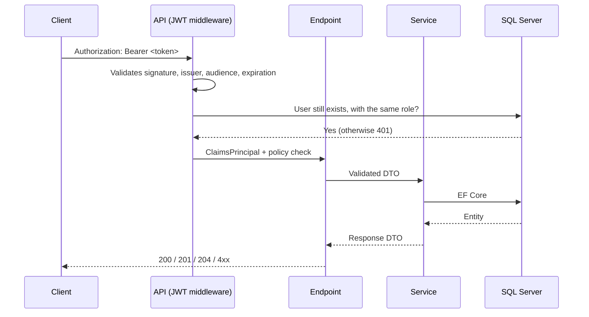
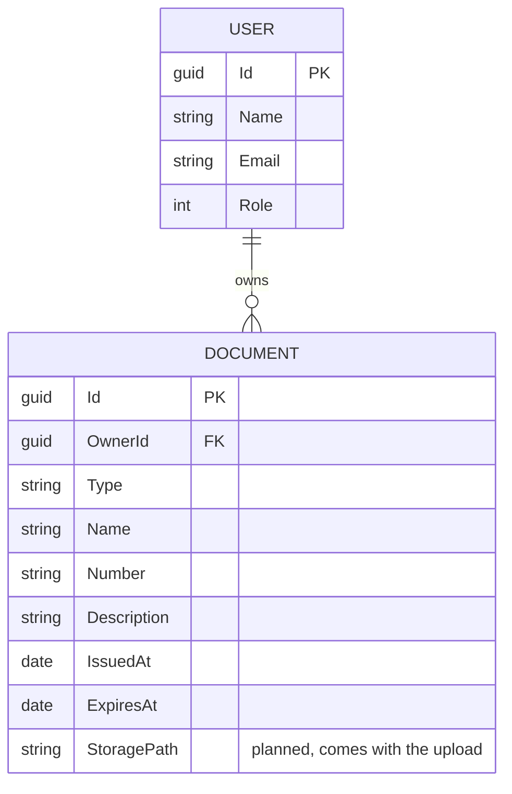

# Authdoc

**A personal document vault: everything organized in one place, ready when it is asked for.**

An application for **organizing and storing personal documents**. Today, what exists is the foundation: an identity and access control API built with **ASP.NET Core 10 (Minimal APIs)**, **JWT**, **Entity Framework Core** and **SQL Server**.

---

## The problem

In August 2026 I went to my immigration appointment in Portugal with every document on the official published list, all of them valid. At the counter, I was told that documents were missing, and those documents were not on that list.

It is not possible to predict everything that may be asked for. What I can control is having every document I own stored, organized and with its expiry date in plain sight. That is how Authdoc was born.

## Product vision

Authdoc is a personal vault: each person keeps their own documents in one place, organized by type, and can find them at the moment they are asked for.

- **Organization:** each document has a type, a number, an issue date and an expiry date
- **Private storage:** upload and access are restricted to the owner
- **Deadline in plain sight:** each document shows a status calculated from the expiry date entered by the user: `Valid`, `ExpiringSoon` (expires within 30 days) or `Expired`

The central guarantee of the project:

> **Each user accesses only their own documents.**

This rule has no exception: the `Admin` role manages accounts, but it does not give access to other users' documents.

That is why the project starts with the identity layer. Authentication, roles and token issuing are the foundation on which the documents module is being built.

### What Authdoc is not

- **It does not say which documents a process requires.** It stores what the user has, not what an institution may ask for.
- **It does not validate documents.** "Within the deadline" only means that the expiry date entered has not passed yet. The application does not check authenticity or whether the document will be accepted.
- **It does not report anyone's legal status and it is not legal advice.**
- **It is not a production service.** It is a portfolio project, with no public environment, and it must not receive real documents from third parties.

## Current status

| Module | Status |
|---|---|
| Authentication (login, JWT issuing) | ✅ Implemented |
| Session (refresh token with rotation and revocation) | ✅ Implemented |
| Password change | ✅ Implemented |
| Role-based authorization (`Admin` / `User`) | ✅ Implemented |
| User management (administrative CRUD and pagination) | ✅ Implemented |
| Public sign-up (self-registration) | ✅ Implemented |
| Rate limiting on sign-up, login, password change, refresh and logout | ✅ Implemented |
| Global exception handling | ✅ Implemented |
| Automatic bootstrap (migrations + initial admin) | ✅ Implemented |
| Unit and integration tests | ✅ Implemented |
| CI pipeline (build and tests) | ✅ Implemented |
| Automatic deploy to Azure App Service | ⏸️ Configured, turned off until a production environment exists |
| **Documents module** | 🚧 In development |
| Document data (create, list, read, update and delete) | ✅ Implemented |
| Document ↔ user link with ownership-based authorization | ✅ Implemented |
| Validity status (`Valid` / `ExpiringSoon` / `Expired`) | 🚧 In development |
| Expiry notification (Workers + Outbox) | 📋 Planned |
| Email verification on sign-up | 📋 Planned |
| **Web frontend** (React + TypeScript, see [Frontend](#frontend)) | 🚧 In development |

Today Authdoc is an **identity and user management API** in which each user can also register, list, read, update and delete the data of their own documents. The validity status and the file upload are still missing (see the [Roadmap](#roadmap)). The documents module reuses all the authentication infrastructure that already exists.

---

## Stack

| Layer | Technology |
|---|---|
| Runtime | .NET 10 |
| Web | ASP.NET Core Minimal APIs |
| Persistence | Entity Framework Core 10 + SQL Server |
| Authentication | JWT Bearer (`Microsoft.AspNetCore.Authentication.JwtBearer`) |
| Password hashing | `IPasswordHasher<T>` from ASP.NET Core Identity (PBKDF2) |
| Documentation | OpenAPI + [Scalar](https://scalar.com) |
| Tests | xUnit + `WebApplicationFactory` + EF Core InMemory |
| CI/CD | Azure Pipelines + Azure App Service |
| Frontend | React 19 + TypeScript + Vite + React Router, linted with oxlint |

## Concepts and fundamentals applied

- **Stateless authentication with JWT:** the token is signed with HMAC-SHA256 and carries identity claims (`NameIdentifier`, `Name`, `Email`, `Role`). The API validates issuer, audience, lifetime and signature on every request, and then checks in the database that the user still exists and still has the role and the security stamp in the token. A password change creates a new security stamp, so every access token made before it stops working at once, on every device.
- **Refresh token with rotation:** each use generates a new token and revokes the previous one. Only the SHA-256 hash is stored in the database. `RevokedAt` is a concurrency token, so when two requests use the same refresh token at the same time, only the first one gets a new session and the other gets `401 INVALID_REFRESH_TOKEN`.
- **Role-based access control (RBAC):** an `Admin` policy protects the administrative routes.
- **Salted password hashing:** passwords are never stored in plain text. The `PasswordHasher` generates PBKDF2 hashes with a random salt and format versioning, which allows a rehash when the algorithm evolves.
- **Dependency injection and service lifetime:** services and the `DbContext` are registered as *Scoped* (one per request). At startup, an explicit scope is created for the database bootstrap.
- **Code-first with EF Core Migrations:** the schema is versioned in code and applied automatically at startup.
- **Layer separation:** endpoints (HTTP) → services (business rules) → `DbContext` (persistence), with DTOs isolating the API contract from the domain model.
- **Resource-based authorization:** every document query is filtered by the owner id taken from the token, and another user's document answers `404`, so its existence is never revealed.
- **GUID identifiers:** they prevent sequential enumeration of resources, which matters when the resources are personal documents.
- **HTTP semantics:** `201 Created` with `Location`, `204 No Content` and `409 Conflict` for a duplicate email.

---

## Architecture

```
├── azure-pipelines.yml            # CI/CD pipeline
├── Authdoc/
│   ├── Program.cs                 # Composition: DI, JWT, policies, rate limiting, bootstrap, HTTP pipeline
│   └── Src/
│       ├── Endpoints/             # HTTP mapping (Minimal API) and input validation
│       ├── Application/
│       │   ├── DTOs/              # Request/response contracts
│       │   └── Services/          # AuthService, UserService, DocumentService (business rules)
│       ├── Data/
│       │   ├── ManagerDbContext.cs  # DbContext and model configuration
│       │   ├── DbInitializer.cs     # Migrations + initial admin seed
│       │   └── Migrations/
│       ├── Models/Entities/       # Domain entities (User, UserRole, RefreshToken, Document)
│       ├── Responses/             # Error format and global exception handling
│       └── Validators/            # Email validation
├── Authdoc.Tests/
│   ├── Integration/               # Full API over HTTP
│   └── *.cs                       # Unit tests
└── frontend/                      # Web client (React + TypeScript + Vite), see Frontend
```

Flow of an authenticated request:


```mermaid
sequenceDiagram
    participant C as Client
    participant A as API (JWT middleware)
    participant E as Endpoint
    participant S as Service
    participant D as SQL Server

    C->>A: Authorization: Bearer <token>
    A->>A: Validates signature, issuer, audience, expiration
    A->>D: User still exists, with the same role?
    D-->>A: Yes (otherwise 401)
    A->>E: ClaimsPrincipal + policy check
    E->>S: Validated DTO
    S->>D: EF Core
    D-->>S: Entity
    S-->>E: Response DTO
    E-->>C: 200 / 201 / 204 / 4xx
```

---

## How to run

### Prerequisites

- [.NET SDK 10](https://dotnet.microsoft.com/download)
- SQL Server (the default configuration points to `localhost\SQLEXPRESS` with Windows integrated authentication)
- Optional: `dotnet tool install --global dotnet-ef`, to manage migrations

### Configuration

The non-sensitive settings are in `Authdoc/appsettings.json`:

```json
{
  "ConnectionStrings": {
    "DefaultConnection": "Server=localhost\\SQLEXPRESS;Database=Authdoc;Trusted_Connection=True;TrustServerCertificate=True;"
  },
  "Jwt": {
    "Issuer": "Authdoc",
    "Audience": "Users",
    "ExpirationInMinutes": 60,
    "RefreshTokenExpirationInDays": 7
  },
  "RateLimiting": {
    "LoginPermitLimit": 5,
    "RefreshPermitLimit": 30,
    "RegisterPermitLimit": 5
  }
}
```

In development, the secrets come from User Secrets. Outside development, the API needs these environment variables:

| Setting | Environment variable | Required |
|---|---|---|
| JWT signing key | `Jwt__Key` | Always |
| Initial admin password | `SeedData__AdminPassword` | While the initial admin does not exist |
| Database connection string | `ConnectionStrings__DefaultConnection` | Always, because the default value only works on the local machine |

### JWT signing key

The signing key is a secret, so it is **not** in `appsettings.json`. The API reads the value of `Jwt:Key`, which must have at least 32 bytes (HS256); with less than that, the API does not start. Generate a random key once and store it in [User Secrets](https://learn.microsoft.com/aspnet/core/security/app-secrets), which stay outside the repository:

```powershell
cd Authdoc

# PowerShell
$bytes = New-Object byte[] 64
[System.Security.Cryptography.RandomNumberGenerator]::Create().GetBytes($bytes)
dotnet user-secrets set "Jwt:Key" ([Convert]::ToBase64String($bytes))
```

```bash
# Bash
dotnet user-secrets set "Jwt:Key" "$(openssl rand -base64 64 | tr -d '\n')"
```

### Initial admin password

The initial admin password is also a secret. Choose a strong password and store it in `SeedData:AdminPassword`:

```powershell
cd Authdoc
dotnet user-secrets set "SeedData:AdminPassword" "<your-strong-password>"
```

It is only needed when the initial admin is created (see [Bootstrap](#bootstrap-the-first-user)). If the admin does not exist yet and the setting is missing, the API fails at startup.

### Starting the API

```bash
git clone <repository-url>
cd Authdoc
dotnet run --project Authdoc
```

- API: `http://localhost:5297`
- Interactive documentation (Scalar, only in `Development`): `http://localhost:5297/scalar`

### Running the tests

```bash
dotnet test
```

| Type | What it covers |
|---|---|
| Unit | `EmailValidator`, the initial admin seed (`DbInitializer`), the `AuthService` rules (a too long password is never hashed, logout revokes the token only once, a refresh token gives only one new session when two requests use it at the same time), the `UserService` rules (last admin, deletion, role change) and the `DocumentService` rules (each operation only reaches the owner's own documents) |
| Integration | The whole API over HTTP with `WebApplicationFactory`: public sign-up, authentication, refresh token, logout, password change, users, documents (including `404` for another user's document), pagination, rate limiting and error codes |

The tests use an **in-memory** database and their own configuration, so they do not need SQL Server or User Secrets.

---

## Frontend

The web client is in the `frontend/` folder. It is in development: today it has the API client, the visual identity, the shared components, the sign-in and sign-up pages, and the session (the user stays signed in after a reload, the token is refreshed on its own, and the user can sign out), and the pages to list, add and edit the user's documents. Deleting a document and changing the password come next.

### Running the frontend

Prerequisite: [Node.js](https://nodejs.org) 20.19 or newer. Start the API first (see [Starting the API](#starting-the-api)), then:

```bash
cd frontend
npm install
npm run dev
```

The app opens at `http://localhost:5173`.

| Command | What it does |
|---|---|
| `npm run dev` | Starts the development server with hot reload |
| `npm run build` | Checks the types and builds the production files into `frontend/dist/` |
| `npm run lint` | Runs the linter (oxlint) |
| `npm run preview` | Serves the production build locally |

### How the frontend talks to the API

- The API has no CORS configuration, so the browser does not call it directly. In development, the Vite server forwards every `/api` request to `http://localhost:5297` (see `frontend/vite.config.ts`).
- All the calls go through `apiRequest` in `frontend/src/api/client.ts`. It adds the `/api` prefix, and every failure becomes an `ApiError` with the HTTP status and a `code`. Calls that need a signed-in user use `authRequest` (see [Session](#session)), which adds the `Bearer` token.
- The `code` is the same as in [Error format](#error-format). The client adds two codes of its own: `NETWORK_ERROR` (the API could not be reached, for example because it is not running) and `UNKNOWN_ERROR` (an answer that did not come in the API format).
- `frontend/src/api/errorMessages.ts` turns a code into the text shown to the user. Most codes use the API message; session, network and server errors have their own text.
- `frontend/src/api/formErrors.ts` decides where a form shows an error: each form maps its validation codes to its fields (for example `EMAIL_INVALID` → the email field), and any other error shows at the top of the form. On the sign-in page, `INVALID_CREDENTIALS` always shows at the top, so the page does not tell whether the email or the password is wrong.

### Session

The session code is in `frontend/src/api/session.ts` (the tokens) and `frontend/src/auth/` (the React side).

| Part | Where it lives | Why |
|---|---|---|
| Access token (JWT) | Only in memory | It lives for one hour, so losing it on a reload is fine |
| Refresh token | `localStorage` | After a reload, the app exchanges it for a new pair of tokens, so the user stays signed in |
| Signed-in user | `AuthContext` (React Context) | Every page can read it with `useAuth()` |

- **Reload:** with a saved refresh token, the app calls `POST /api/auth/refresh` when it opens. While it waits, the protected pages show "Loading...".
- **Automatic refresh:** when a call with a token gets `401 UNAUTHORIZED` (expired token or changed role), `authRequest` refreshes the tokens and sends the call once more. Only one refresh runs at a time: the API accepts each refresh token only once, so two refreshes at the same time would end the session.
- **Session ended:** when the API rejects the refresh token, the app forgets the tokens and opens the sign-in page with "Your session has ended".
- **Sign out:** the app forgets the tokens at once and calls `POST /api/auth/logout`, which revokes the refresh token on the server. The other devices of the user stay signed in.
- **Protected pages:** `RequireAuth` sends a user without a session to the sign-in page, and after the sign-in the user goes back to the page they tried to open.
- **Known limitation:** any script on the page can read `localStorage`, so an XSS bug could steal the refresh token. The safer option is an `httpOnly` cookie set by the API, which the browser sends but scripts cannot read. Two tabs that refresh at the same moment can also sign one of them out.

### Pages

The routes are in `frontend/src/App.tsx` (React Router).

| Route | Access | Page |
|---|---|---|
| `/` | Public | Home: links to sign in and to create an account, or to "My documents" and "My account" for a signed-in user |
| `/login` | Public | Sign in. After it, the page the user tried to open, or `/account` |
| `/register` | Public | Create an account. After it, the sign-in page opens with the email already filled in |
| `/account` | Signed in | My account: name, email, role and sign-up date, read from `GET /api/auth/me` |
| `/documents` | Signed in | My documents: a table with 10 documents per page, read from `GET /api/documents` |
| `/documents/new` | Signed in | Add document: the document form, saved with `POST /api/documents` |
| `/documents/:id/edit` | Signed in | Edit document: the same form, filled from `GET /api/documents/{id}` and saved with `PUT /api/documents/{id}` |
| any other | Public | Page not found |

A signed-in user who opens `/login` or `/register` goes to `/account`. The header shows a "Documents" link, the user's name and a "Sign out" button.

On `/documents`:

- The page number is in the address (`/documents?page=2`), so a reload or the Back button keeps the same page. A wrong value, like `?page=abc`, opens page 1.
- The page shows "Loading documents..." while it waits, a message when the user has no documents, and the error with a "Try again" button when the call fails. A page after the last one (for example `?page=99`) offers a link back to page 1.
- Dates without a time (`issuedAt`, `expiresAt`) are formatted in UTC. Read as local time, `"2026-11-01"` would show as Oct 31 in Brazil (UTC-3).

On the add and edit pages:

- Both pages use one form (`frontend/src/pages/DocumentForm.tsx`). The Type field suggests common types while the user types, and accepts any other text.
- Each validation code of the API shows under its field, for example `ISSUED_AT_IN_FUTURE` under the issue date. The fields also stop at the API size limits (50, 100, 50 and 500 characters); the API still checks them.
- An empty issue date is left out of the request, so the API answers `ISSUED_AT_REQUIRED`. An empty expiry date is sent as `null` (no expiry).
- After a save, the list opens with "Document added." or "Document updated.". A new document opens the last page, because the list shows the oldest documents first. Edit and Cancel go back to the list page where the user was.
- A document that does not exist, belongs to another user, or has a wrong id in the address shows "This document does not exist or was deleted.".

The development server answers every route with `index.html`, so a page also opens when you type its address or reload it. A production server needs the same rule.

### Structure

```
frontend/
├── index.html
├── vite.config.ts           # Dev server and /api proxy
└── src/
    ├── main.tsx             # Entry point, with the router and the session provider
    ├── App.tsx              # Routes: which page each address shows
    ├── index.css            # Visual identity: colors, fonts, sizes and spacing as CSS variables
    ├── api/                 # API client, session tokens, auth calls, types and error messages
    ├── auth/                # Session in React: AuthContext, AuthProvider, RequireAuth
    ├── pages/               # One component per page: Home, Login, Register, Account, NotFound
    └── shared/              # Shared components: Alert, Button, Input, PageLayout
```

The visual identity uses only system fonts and no external server: the page does not load fonts, scripts or styles from the internet.

The CI pipeline does not build the frontend yet.

---

## CI/CD

The pipeline is in `azure-pipelines.yml` and runs on every change to the `main` branch:

1. Restores the dependencies
2. Builds in `Release`
3. Runs the tests; if any test fails, the deploy does not happen
4. Publishes the API and generates the `drop` artifact
5. Deploys to Azure App Service, only on `main` and with the `deployEnabled` variable set to `'true'`

The deploy is turned off (`deployEnabled: 'false'`) until the production database and settings exist. The other steps keep running.

---

## How I use AI in the project

I use AI agents in the development, with fixed rules:

- Branches, code and commits follow a standard defined by me, applied by skills and subagents dedicated to specific tasks
- Every change is reviewed by me before the merge
- I also use AI to study the concepts behind what was generated: the goal is to be able to explain every decision described in this README

---

## Bootstrap: the first user

Anyone can create an account, but a new account always has the `User` role. The `Admin` role is only given by another admin, through `PATCH /api/users/{id}/role`. This creates a classic "chicken and egg" problem: without an admin, nobody can become an admin.

The `DbInitializer` solves this when the application starts:

1. **Applies the pending migrations** (`Database.MigrateAsync()`). The database is created if it does not exist yet.
2. **Checks whether any user with the `Admin` role already exists.** If one exists, it does nothing. The operation is idempotent and safe to run at every startup.
3. **If a normal user already has the default admin email**, the API stops at startup with a clear message. It never promotes that user, because the person who created it does not know the seed password. On the first start this cannot happen, because the seed runs before the API accepts requests; it can happen later, if no admin exists anymore (for example, after a database restore or a manual change in the database). To fix it, delete or rename that user in the database and start the API again.
4. **Otherwise, it creates the initial admin**, with the password going through the same `IPasswordHasher` used in the register and login flow.

Initial admin credentials:

| Email | Password |
|---|---|
| `admin@system.com` | The value configured in `SeedData:AdminPassword` (see [Initial admin password](#initial-admin-password)) |

### First complete flow

```http
### 1. Create an account (no token needed)
POST http://localhost:5297/api/auth/register
Content-Type: application/json

{
  "name": "Maria Silva",
  "email": "maria@gmail.com",
  "password": "password123",
  "confirmationPassword": "password123"
}

### 2. Log in with the new user
POST http://localhost:5297/api/auth/login
Content-Type: application/json

{ "email": "maria@gmail.com", "password": "password123" }

### 3. Register a document (use the token returned in step 2)
POST http://localhost:5297/api/documents
Authorization: Bearer <token>
Content-Type: application/json

{
  "type": "Passport",
  "name": "My passport",
  "number": "FZ123456",
  "issuedAt": "2024-01-10",
  "expiresAt": "2034-01-10"
}
```

The admin logs in the same way, with `admin@system.com` and the password from `SeedData:AdminPassword`.

---

## Endpoints

### Auth

| Method | Route | Access | Description |
|---|---|---|---|
| `POST` | `/api/auth/login` | Public | Authenticates and returns the JWT, the refresh token, the expirations and the user data |
| `POST` | `/api/auth/refresh` | Public | Exchanges a valid refresh token for a new pair of tokens |
| `POST` | `/api/auth/logout` | Public | Ends one session: revokes the refresh token in the body (`{ "refreshToken": "..." }`) and returns `204` |
| `PUT` | `/api/auth/password` | Authenticated | Changes the user's own password (ends the other sessions) |
| `POST` | `/api/auth/register` | Public | Creates a new account, always with the `User` role |
| `GET` | `/api/auth/me` | Authenticated | Returns the current user from the database (`id`, `email`, `name`, `role`, `createdAt`, `updatedAt`), the same format as `GET /api/users/{id}` |

### Users

| Method | Route | Access | Description |
|---|---|---|---|
| `GET` | `/api/users?page=1&pageSize=10` | Admin | Lists users with pagination (`pageSize` from 1 to 100) |
| `GET` | `/api/users/{id}` | Admin | Returns one user |
| `PUT` | `/api/users/{id}` | Admin | Updates name and email |
| `PATCH` | `/api/users/{id}/role` | Admin | Changes the user's role (`Admin` or `User`) |
| `DELETE` | `/api/users/{id}` | Admin | Removes a user |

### Documents

Every route acts only on the documents of the user in the token. The `Admin` role gives no extra access here.

| Method | Route | Access | Description |
|---|---|---|---|
| `POST` | `/api/documents` | Authenticated | Registers a document and returns `201` with `Location` |
| `GET` | `/api/documents?page=1&pageSize=10` | Authenticated | Lists the user's own documents with pagination (`pageSize` from 1 to 100) |
| `GET` | `/api/documents/{id}` | Authenticated | Returns one document |
| `PUT` | `/api/documents/{id}` | Authenticated | Updates a document |
| `DELETE` | `/api/documents/{id}` | Authenticated | Removes a document |

Request body for `POST` and `PUT`:

```json
{
  "type": "Passport",
  "name": "My passport",
  "number": "FZ123456",
  "description": "Brazilian passport",
  "issuedAt": "2024-01-10",
  "expiresAt": "2034-01-10"
}
```

### Business rules

- The email must be valid, from any domain, and unique in the database; it is validated on registration and on update
- The email is normalized (trimmed and lowercased) before validating, searching or saving
- The name is required, with at most 100 characters; it is trimmed before validating and saving
- The password has from 8 to 128 characters, cannot be only spaces, and is confirmed on registration
- A password longer than 128 characters is never hashed: on login the answer is `401 INVALID_CREDENTIALS`, and as the current password in a password change it is `400 CURRENT_PASSWORD_INCORRECT` (the same answers as a wrong password)
- Sign-up is public and always creates an account with the `User` role; a role sent in the request body is ignored
- Sign-up, login and password change are limited to 5 attempts per minute per IP, and refresh and logout to 30; above that the API responds with `429`
- The refresh token is valid for 7 days, can be used only once (each use generates a new one) and is stored only as a SHA-256 hash
- Changing the password revokes all the user's refresh tokens
- Logout revokes only the refresh token that was sent, so the other sessions of the user stay active. The answer is `204` even for an unknown or already revoked token, so it does not tell whether a token exists. The JWT of that session keeps working until it expires (see Known limitations)
- The role cannot be changed through the update endpoint, which prevents privilege escalation through the payload
- The role is changed only through `PATCH /api/users/{id}/role`, with the body `{ "role": "Admin" }` or `{ "role": "User" }`
- A role change or a user deletion takes effect at once: every request checks that the user of the token still exists and still has the role in the token, otherwise the answer is `401 UNAUTHORIZED`, and the client must refresh or log in again
- An admin cannot change their own role, and the last admin of the system cannot be demoted
- An admin cannot delete their own user, and the last admin of the system cannot be deleted
- The last admin check runs in a transaction that locks the admin rows (`UPDLOCK, HOLDLOCK`), so two simultaneous requests cannot demote or delete the last two admins
- A document belongs to the user in the token; an owner id sent in the request body is ignored
- Reading, updating or deleting a document of another user returns `404`, the same answer as for a document that does not exist
- Document type and number are required, with at most 50 characters each; the name is required, with at most 100; the description is optional, with at most 500
- Document text fields are trimmed before validating and saving, and a blank description is saved as empty
- The issue date is required and cannot be in the future (one day of tolerance covers clients ahead of UTC)
- The expiry date is optional; when sent, it must be after the issue date. A document that has already expired can be registered
- Unexpected exceptions are intercepted and logged in one central place by the `IExceptionHandler`, without exposing internal details to the client

### Error format

The API error responses have the same format, with a stable `code` (for the client to handle) and a readable `message`:

```json
{ "code": "EMAIL_INVALID", "message": "Email is invalid" }
```

| Status | Codes |
|---|---|
| `400` | `INVALID_REQUEST`, `NAME_REQUIRED`, `NAME_TOO_LONG`, `EMAIL_REQUIRED`, `EMAIL_INVALID`, `PASSWORD_REQUIRED`, `PASSWORD_TOO_SHORT`, `PASSWORD_TOO_LONG`, `PASSWORDS_DO_NOT_MATCH`, `ROLE_INVALID`, `CANNOT_CHANGE_OWN_ROLE`, `CANNOT_DELETE_OWN_USER`, `CURRENT_PASSWORD_REQUIRED`, `CURRENT_PASSWORD_INCORRECT`, `NEW_PASSWORD_SAME_AS_CURRENT`, `REFRESH_TOKEN_REQUIRED`, `PAGE_INVALID`, `PAGE_SIZE_INVALID`, `TYPE_REQUIRED`, `TYPE_TOO_LONG`, `NUMBER_REQUIRED`, `NUMBER_TOO_LONG`, `DESCRIPTION_TOO_LONG`, `ISSUED_AT_REQUIRED`, `ISSUED_AT_IN_FUTURE`, `EXPIRES_AT_BEFORE_ISSUED_AT` |
| `401` | `INVALID_CREDENTIALS`, `INVALID_REFRESH_TOKEN`, `UNAUTHORIZED` |
| `403` | `FORBIDDEN` |
| `404` | `USER_NOT_FOUND`, `DOCUMENT_NOT_FOUND` |
| `409` | `EMAIL_ALREADY_IN_USE`, `LAST_ADMIN` |
| `429` | `TOO_MANY_REQUESTS` |
| `500` | `INTERNAL_ERROR` |

The codes are centralized in `Src/Responses/ApiErrors.cs`.

---

## Roadmap

### In development: documents module

The goal is to link each document to its owner in the database and apply **resource-based authorization**: besides being authenticated, the user only reads, changes or removes documents that belong to them.


```mermaid
erDiagram
    USER ||--o{ DOCUMENT : owns
    USER {
        guid Id PK
        string Name
        string Email
        int Role
    }
    DOCUMENT {
        guid Id PK
        guid OwnerId FK
        string Type
        string Name
        string Number
        string Description
        date IssuedAt
        date ExpiresAt
        string StoragePath "planned, comes with the upload"
    }
```

Module rules:

- `Document` entity with the foreign key `OwnerId → User.Id`; deleting a user deletes their documents
- The `OwnerId` always comes from the `NameIdentifier` claim of the token, never from the request body
- Queries are filtered by owner (`WHERE OwnerId = @currentUser`), with `404` for other users' documents, without revealing that they exist
- The `Admin` role does not give access to other users' documents
- File storage behind an interface, with a local disk implementation, so the API does not depend on the physical location
- Upload restricted to PDF, JPG and PNG, with at most 10 MB
- Validity status calculated from `ExpiresAt`: `Valid`, `ExpiringSoon` (expires within 30 days) or `Expired`
- A document without an expiry date is always `Valid`

Validity status rule:

| `ExpiresAt` | Status |
|---|---|
| Not set | `Valid` |
| More than 30 days from today | `Valid` |
| Today or within the next 30 days | `ExpiringSoon` |
| Before today | `Expired` |

The status is only returned when the document is read. No notification is sent in this stage.

Progress:

| Step | Status |
|---|---|
| `Document` entity, `Documents` table and relation to `User` | ✅ Done |
| Request and response DTOs | ✅ Done |
| `DocumentService` (create, list, get, update and delete, always filtered by owner) with unit tests | ✅ Done |
| HTTP routes with input validation (see [Documents](#documents)) | ✅ Done |
| Integration tests for the routes | ✅ Done |
| Validity status | 📋 To do |
| File upload and storage | 📋 To do |

Definition of done for the module:

1. Send a document (file, type, number, issue date and expiry date)
2. List and read only the user's own documents
3. Reading, changing or removing another user's document returns `404`
4. Each document returned carries the validity status
5. Integration tests for points 2 and 3 and unit tests for the status rule

### Later

- **Email verification:** today an account can be created with an email that does not belong to the person. The plan is to confirm the email before the account can be used
- **Expiry notification:** actively warn the user, with Workers and Outbox. In this stage the deadline appears only as a status when the document is read

### Open question

A point that needs a decision before any real use:

| Question | Why it matters |
|---|---|
| Sensitive personal data (GDPR) | Passports and residence permits require encryption at rest, a retention policy and deletion at the request of the data subject |

### Base evolution

- [x] Resource-based authorization for documents (owner filter in `DocumentService`)
- [ ] Centralized validation (FluentValidation)
- [ ] Docker Compose (API + SQL Server)
- [x] Build and test pipeline (deploy configured, turned off)
- [x] Unique email index and length limits on `Email` and `Name`
- [x] Global exception handling
- [x] Refresh token and session revocation
- [x] Rate limiting on login
- [x] Paginated user list
- [x] Secrets through User Secrets / environment variables
- [x] Unit and integration tests (xUnit + `WebApplicationFactory`)

---

## Security

The JWT key and the initial admin password are not versioned: in development they come from User Secrets and, in the other environments, from environment variables (see [Configuration](#configuration)). In any real environment, the admin password must be changed on the first access.

### Known limitations

| Limitation | Impact | Possible solution |
|---|---|---|
| A logout does not end the current JWT | The access token of that device keeps working for up to `Jwt:ExpirationInMinutes` (its refresh token is already revoked). A password change, a deleted user or a changed role is already blocked on every request | A short `Jwt:ExpirationInMinutes`, or a list of revoked token ids checked on every request |
| One database query per authenticated request | The user check adds one small query (by primary key) to every request with a token | Cache the check for a short time if the load grows |
| Rate limiting is in memory and per IP | It resets when the API restarts, it is not shared between instances and, behind a proxy, everyone can look like the same IP | Distributed rate limiting (e.g. Redis) and `ForwardedHeaders` configuration |
| The email is not verified on sign-up | A person can create an account with an email that is not theirs | Send a confirmation link and block the login until the email is confirmed |
| Sign-up reveals whether an email has an account | The `409 EMAIL_ALREADY_IN_USE` answer lets anyone test which emails are registered | Answer every sign-up the same way and send the result by email |
| Integration tests use an in-memory database | The unique email index is not checked by the database in the tests | Tests with a real SQL Server (e.g. Testcontainers) |
